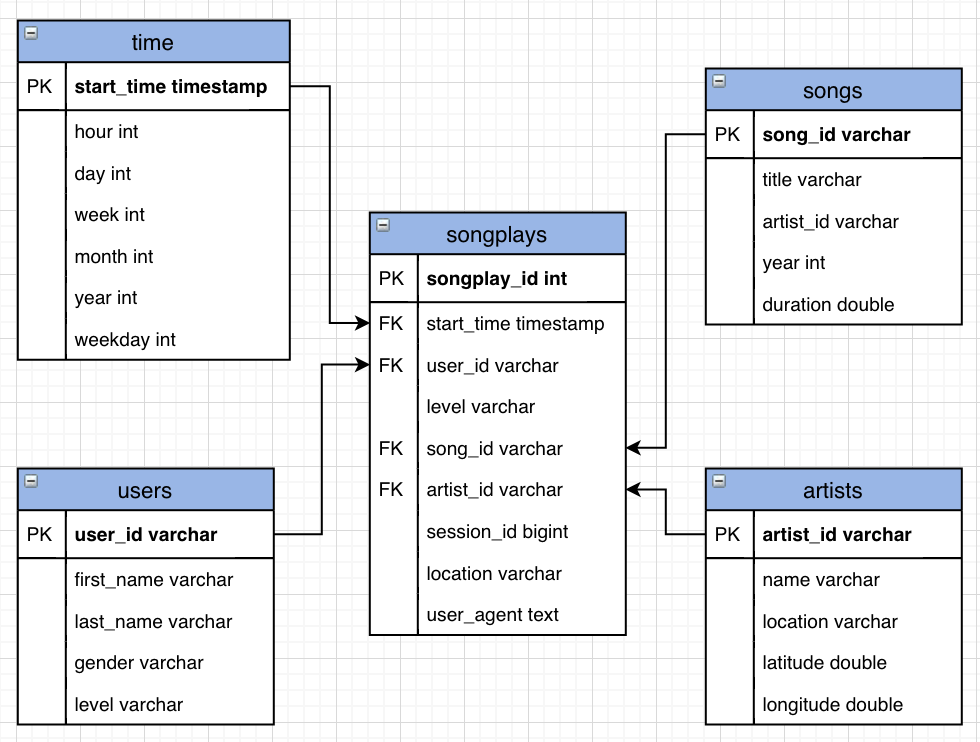

# Data Lake

## Introduction
A music streaming startup, *Sparkify*, has grown their user base and song database even more and wants to move their data warehouse to a data lake. Their data resides in S3, in a directory of JSON logs on user activity on the app, as well as a directory with JSON metadata on the songs in their app.

## Project Description
This project implements an ETL pipeline for a data lake hosted on S3. It loads data from S3, processes the data into analytics tables using Spark, and loads them back into S3. The Spark process is deployed on a cluster using AWS.

## Project Datasets
There are two datasets that reside in S3:
- Song data: `s3://udacity-dend/song_data`
- Log data: `s3://udacity-dend/log_data`

### Song Dataset
The first dataset is a subset of real data from the [Million Song Dataset](https://labrosa.ee.columbia.edu/millionsong/). Each file is in JSON format and contains metadata about a song and the artist of that song. The files are partitioned by the first three letters of each song's track ID.

Here are example filepaths in the dataset:
```
song_data/A/B/C/TRABCEI128F424C983.json
song_data/A/A/B/TRAABJL12903CDCF1A.json
```

Below is an example of what a single song file looks like:
```
{"num_songs": 1, "artist_id": "ARJIE2Y1187B994AB7", "artist_latitude": null, "artist_longitude": null, "artist_location": "", "artist_name": "Line Renaud", "song_id": "SOUPIRU12A6D4FA1E1", "title": "Der Kleine Dompfaff", "duration": 152.92036, "year": 0}
```

### Log Dataset
The second dataset consists of log files in JSON format generated by this [event simulator](https://github.com/Interana/eventsim) based on the songs in the dataset above. These simulate app activity logs from an imaginary music streaming app based on configuration settings.

Logs in the dataset are partitioned by year and month.

Here are filepaths to two files in this dataset:
```
log_data/2018/11/2018-11-12-events.json
log_data/2018/11/2018-11-13-events.json
```

## Schema for Song Play Analysis
Using the song and log datasets, a star schema is used for optimized queries on song play analysis.

This includes the following tables:
**Fact Table**
- **songplays** - records in log data associated with song plays (i.e. records with page `NextSong`)

**Dimension Tables**
- **users** - users in the app
- **songs** - songs in the music database
- **artists** - artists in the music database
- **time** - timestamps of records in **songplays** broken down into specific time units



## Project Files
The project includes a couple necessary files:
- `etl.py` - reads data from S3, processes that data using Spark, and writes them back to S3
- `dl.cfg` - contains AWS credentials
